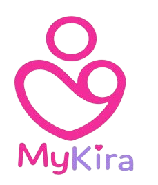

## Brand Guide
A simple guide to our brand's look and voice. It covers our official logo, core colors, text fonts, and graphic icons. Use these rules to keep our messaging clear, consistent, and recognizable across all designs, marketing, and products.

**Logo**   

**Official colours**

| Name | HEX | Usage |
| :---- | :---- | :---- |
| Light Pink | \#FDE5F3 | Background |
| Pink | \#F22C99 | Logo, buttons and icons |
| Purple | \#A982E8 | Logo and icons |
| Black | \#000000 | Text |

**Typography**  
Headings: Roboto, Bold  
Body: Roboto, Medium  
Code font: Courier, monospace

**Imagery and Icons**

* Use maternal health related images and icons inline with the application: mothers, community interaction, challenges and chatbot.  
* Avoid stock images which are unrelated to maternal health.

**Voice and messaging**  
Values: Empathy, Privacy and Safety.  
Tone: Warm, Supportive, Clear, Direct, Calm and Reassuring.

