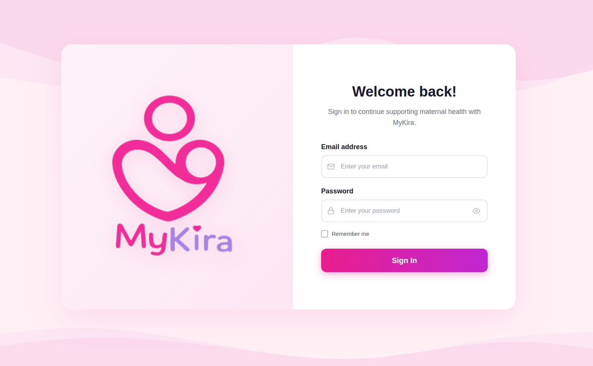

  ✨ Maternal Health AI System
  <h1 class="mk-hero-title">MyKira Technical Documentation</h1>
  

    Zambia's flagship AI-powered maternal health platform combining WHO-aligned clinical risk modeling, low-bandwidth mobile access, and real-time triage dashboards.
  

  

    <a href="https://my-kira.vercel.app/" class="mk-btn mk-btn--gradient" target="_blank" rel="noopener">🌐 Explore Informational Website</a>
    <a href="how-it-works.md" class="mk-btn mk-btn--outline">📖 Architecture Overview</a>
  

  

    
  

  

    
  

  

    
  

  
  
  

---

## About Us

**MyKira** is an Android mobile platform designed for maternal health monitoring and early risk detection in Zambia. Built to directly address community-level delays in seeking care—which account for 46.0% of local maternal deaths—MyKira provides mothers with an everyday home screening tool to recognize pregnancy danger signs early.

### Core Pillars & Framework

* **WHO & MoH Alignment**: Integrates a rule-based risk scoring engine structured according to the Zambian Ministry of Health Guidelines and the WHO PCPNC (Pregnancy, Childbirth, Postpartum, and Newborn Care) framework.
* **AI-Guided Support**: Features an interactive AI post-assessment chatbot providing instant, personalized guidance to help mothers understand when to seek emergency clinical care.
* **Community & Accountability**: Bridges peer isolation through trimester-matched community hubs, real-time peer chat, and weekly healthy habit challenges.
* **Care Continuity**: Includes appointment and medication reminders to reduce care drop-off and ensure continuous health tracking.

  

    46.0%
    Community Delays Addressed
  

  

    WHO & MoH
    PCPNC Protocol Aligned
  

  

    Risk Evaluation
    Early At-Home Detection
  

---

## Developer Onboarding & Support

!!! tip "Quick Start Guide"
    If you are setting up the development environment for the first time, consult [How It Works](how-it-works.md) for pre-requisites and container configurations.

!!! question "Contribution Guidelines"
    Before submitting pull requests, review our [Code Standards](code-standards.md) and [Q/A Process](qa-process.md).

